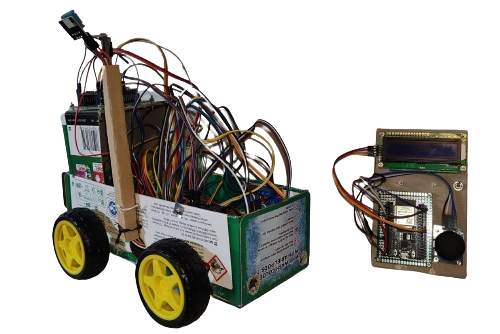

# Robot de Exploracion Ambiental
- Universidad de Buenos Aires - Especializacion en Sistemas Embebidos
- Proyecto integrador
- Mg. Ing. Gonzalo Carreno

## Demo

## Arquitectura de hardware del sistema

El hardware implementado consta de dos componentes principales:

- **Joystick**
- **Robot**

A continuación se pueden apreciar imágenes descriptivas de los mismos, así como su diseño y partes internas:

### Hardware del robot

#### Perspectivas del hardware del robot

Perspectivas detalladas de los sub-componentes de hardware del robot

Conexionado lógico del hardware del robot

### Hardware del joystick

#### Perspectivas detalladas de los sub-componentes de hardware del joystick

#### Conexionado lógico del hardware del joystick

## Arquitectura de software del sistema

### Despliegue de software

La arquitectura de software del sistema está formada por el firmware del robot y el del joystick.

---

### Firmware del robot

El firmware del robot tiene internamente ciertos componentes de software específicos cuyos módulos no están disponibles en el firmware del joystick:

- **Measuring Service**: componente de control de dispositivos y sensores para medir parámetros ambientales.  
- **Motors Service**: componente de control del movimiento de los motores.

### Firmware del joystick

El firmware del joystick tiene a su vez ciertos componentes no disponibles en el firmware del robot:

- **Display Service**: componente utilizado para el control y escritura en el dispositivo display por medio de I2C.  
- **Joystick Service**: componente utilizado para el control y lectura de la palanca analógica del joystick para controlar el movimiento del robot.

### Componentes comunes

Hay ciertos módulos y componentes que son comunes a ambos firmwares:

- **Measuring State**: componente de software que almacena el estado de las mediciones de parámetros ambientales en el robot y el joystick.  
- **Robot Position State**: componente en el que se almacena el estado de la posición actual del robot tras recibir el último movimiento a realizar.  
- **ADC Service**: componente que implementa el control del driver ADC disponible en ESP32 para la lectura de ciertos dispositivos, como por ejemplo el fotoresistor (en el robot) y el control analógico (en el joystick).  
- **UDP Communication**: componente que implementa las operaciones comunes para la conexión Wi-Fi y comunicación UDP cliente servidor.

## Despliegue físico y capas del sistema

Con respecto al despliegue físico, tanto el firmware del **robot** como el del **joystick** corren sobre **ESP32**.  
En el caso del robot se utilizó un **ESP32-WROOM-32D**, y en el caso del joystick un **ESP32-WROOVER-B**.

### Capas principales del despliegue

A nivel de capas, el sistema se organiza en **cuatro capas principales**:

1. **Aplicación**  
   El firmware desplegado (código del robot o del joystick).

2. **Bibliotecas de terceros**  
   Bibliotecas y utilitarios utilizados desde el código productivo.

3. **Framework ESP-IDF**  
   Runtime provisto por **Espressif** que contiene la implementación del sistema operativo **FreeRTOS**, así como código de bibliotecas y drivers genéricos para el control de los módulos embebidos en ESP32 (por ejemplo Wi-Fi, ADC, etc.).

4. **HAL (Hardware Abstraction Layer)**  
   Capa de abstracción de más bajo nivel, accedida por el sistema operativo **FreeRTOS** para el control del ESP32 y su hardware.

### Diagrama de despliegue

En el siguiente diagrama se puede apreciar una imagen del mismo:

### Algoritmos de funcionamiento

En la siguiente imagen pueden apreciarse los **algoritmos en pseudocódigo** del funcionamiento de las tareas involucradas del Robot y del Joystick:

